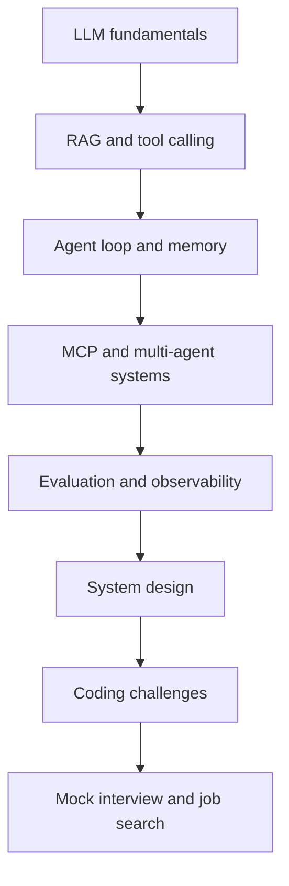

# Agent Engineer Interview

> The open-source interview handbook for Agent Engineers.

Prepare for Agent Engineer, AI Engineer, and Agentic Software Engineer interviews with an engineering-first learning path. This repository connects fundamentals to production trade-offs, hands-on coding, system design, portfolio projects, and interview storytelling.

## What problem does this solve?

Agent interviews often mix LLM concepts, distributed-systems judgment, product thinking, and practical coding. A list of links does not show how those pieces fit together. This handbook gives you a sequence, a vocabulary for explaining decisions, and small exercises that run without a paid model API.

## Who is it for?

- Engineers moving from backend, frontend, QA, DevOps, or data engineering into agent engineering.
- AI/ML engineers who want stronger production and interview communication skills.
- Candidates preparing for junior through staff-level interviews.
- Interviewers and hiring teams looking for consistent question prompts and evaluation rubrics.

## Start here

1. [Choose your starting point](docs/getting-started/how-to-use-this-repo.md).
2. Take the [skill assessment](docs/getting-started/skill-assessment.md).
3. Follow the [30-day interview plan](docs/roadmaps/30-day-interview-plan.md), adjusting the pace to your baseline.
4. Build one [coding challenge](coding-challenges/README.md) and explain its trade-offs out loud.
5. Practice with a [mock interview](mock-interviews/README.md) and turn the result into a portfolio story.

## Learning path

The path is deliberately iterative: after each section, explain one concept, implement one small behavior, and name one failure mode.

## Core modules

| Module | What you will practice | Entry point |
| --- | --- | --- |
| Fundamentals | Tokens, attention, embeddings, structured output, function calling | [Fundamentals](docs/fundamentals/llm-basics.md) |
| Agent engineering | Loops, planning, memory, reflection, tools, human approval | [What is an agent?](docs/agent-engineering/what-is-an-agent.md) |
| Retrieval | Chunking, hybrid search, reranking, failure modes | [RAG overview](docs/rag/rag-overview.md) |
| Protocols | MCP, A2A, tool contracts, protocol selection | [MCP](docs/protocols/mcp.md) |
| Production | Evaluation, tracing, reliability, security, cost | [Production checklist](docs/production/production-checklist.md) |
| System design | Scoping, architecture, bottlenecks, trade-offs | [Framework](docs/system-design/system-design-framework.md) |
| Interview practice | Question banks, coding, behavioral and mock interviews | [Agent Engineer question bank](docs/interview-questions/agent-engineer-question-bank.md) |
| Job search | Resume bullets, portfolio selection, storytelling | [Resume guide](docs/job-search/resume-guide.md) |

## Pick a route by experience

- **New to agents:** [Beginner roadmap](docs/roadmaps/beginner-roadmap.md) → [LLM basics](docs/fundamentals/llm-basics.md) → Challenge 1.
- **Already building AI applications:** [Intermediate roadmap](docs/roadmaps/intermediate-roadmap.md) → [RAG](docs/rag/rag-overview.md) → evaluation harness.
- **Senior or staff candidate:** [Senior roadmap](docs/roadmaps/senior-roadmap.md) → [system design framework](docs/system-design/system-design-framework.md) → production incident drills.
- **Coming from a traditional engineering role:** [Transition guide](docs/career-paths/traditional-engineer-to-agent-engineer.md).

## High-frequency interview themes

Be ready to explain not just *what* a technique is, but when it fails and how you would measure it:

- Agent loop vs deterministic workflow
- Context engineering, structured output, and tool calling
- RAG quality, retrieval recall, grounding, and freshness
- Memory boundaries and privacy
- Planning, reflection, multi-agent coordination, and human approval
- MCP and protocol design
- Evaluation, regression tests, observability, cost, latency, and reliability
- Prompt injection, data exfiltration, permissions, and safe tool execution

## Coding challenges

The five starter exercises are standalone Python 3.11+ projects with standard-library solutions and tests:

1. [Tool calling agent](coding-challenges/01-tool-calling-agent/README.md)
2. [Minimal RAG pipeline](coding-challenges/02-rag-pipeline/README.md)
3. [Session and long-term memory](coding-challenges/03-agent-memory/README.md)
4. [Minimal MCP server](coding-challenges/04-mcp-server/README.md)
5. [Agent evaluation harness](coding-challenges/05-agent-evaluation/README.md)

Run any challenge with `python -m unittest discover -s tests -v`. No API key is needed for the included tests.

## System design cases

Use the framework to work through a [coding agent](docs/system-design/design-a-coding-agent.md), RAG assistant, research agent, customer-support agent, multi-agent platform, or agent observability platform. Each case should end with explicit assumptions, SLOs, failure handling, and a trade-off you would revisit after launch.

## Suggested order

Read a concept, answer its interview prompts in two minutes, implement a small slice, and then revisit the concept after testing a failure. The [how-to guide](docs/getting-started/how-to-use-this-repo.md) explains how to turn passive reading into evidence you can discuss in an interview.

## Content status

- ✅ **Core:** reviewed, runnable, or detailed enough for an interview session.
- 🧪 **Practice:** intentionally asks you to implement, measure, or investigate.
- 📝 **Expanding:** useful starting notes with more examples welcome.

## Roadmap

See [ROADMAP.md](ROADMAP.md) for the next content slices, including deeper framework comparisons, multilingual coverage, and more production incident drills.

## Contributing

Corrections, original questions, new challenges, and anonymized interview experiences are welcome. Start with [CONTRIBUTING.md](CONTRIBUTING.md), use the templates, and do not share confidential interview material or company data.

## License

MIT. See [LICENSE](LICENSE).

阅读中文入口：[README.zh-CN.md](README.zh-CN.md)。
