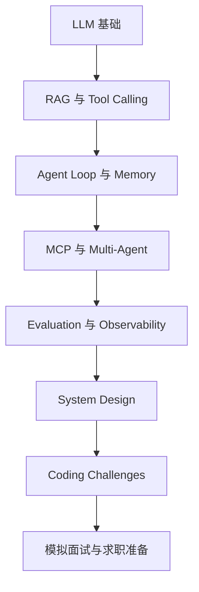

# Agent Engineer Interview

> 面向 Agent Engineer 的开源面试手册。

这是一个面向求职和工程实践的 Agent 面试知识库，覆盖 LLM 基础、RAG、Tool Calling、MCP、Memory、Planning、Multi-Agent、Evaluation、Observability、Security、System Design、Coding Challenges、项目作品集与行为面试。

## 30 秒了解项目

Agent 面试同时考察模型知识、软件工程、系统设计、可靠性和沟通表达。本仓库用一条可执行的学习路径把这些能力串起来：先理解概念，再回答问题，接着完成无需付费 API 的 Python 练习，最后用系统设计和模拟面试验证自己。

适合：

- 准备 Agent Engineer、AI Engineer、Agentic Software Engineer 面试的求职者；
- 从后端、前端、测试、DevOps、数据工程转型的工程师；
- 想构建真实 Agent 项目和作品集的开发者；
- 面试官、招聘经理和技术团队。

## 从哪里开始

1. 阅读[如何使用本仓库](docs/getting-started/how-to-use-this-repo.md)。
2. 完成[技能自测](docs/getting-started/skill-assessment.md)。
3. 按自己的基础选择[学习路线](docs/roadmaps/beginner-roadmap.md)或[30 天计划](docs/roadmaps/30-day-interview-plan.md)。
4. 完成一个[编码挑战](coding-challenges/README.md)，并准备讲清楚权衡。
5. 用[模拟面试](mock-interviews/README.md)检验表达能力。

## 学习路径

## 内容导航

| 模块 | 入口 |
| --- | --- |
| 基础与 Agent 工程 | [What is an agent?](docs/agent-engineering/what-is-an-agent.md) |
| RAG 与协议 | [RAG overview](docs/rag/rag-overview.md)、[MCP](docs/protocols/mcp.md) |
| 评测与生产 | [Agent evaluation](docs/evaluation/agent-evaluation.md)、[Production checklist](docs/production/production-checklist.md) |
| 系统设计 | [System design framework](docs/system-design/system-design-framework.md) |
| 面试题与练习 | [Agent Engineer 通用题库](docs/interview-questions/agent-engineer-question-bank.md)、[Coding challenges](coding-challenges/README.md) |
| 简历与作品集 | [Resume guide](docs/job-search/resume-guide.md)、[Project storytelling](docs/job-search/project-storytelling.md) |

首次版本以英文内容为主，中文 README 用于导航；欢迎按同一结构补充 `*-zh-CN.md` 双语页面。

## 贡献与许可证

请先阅读[贡献指南](CONTRIBUTING.md)。欢迎提交原创面试题、系统设计案例、可运行练习和脱敏面经，但请勿提交公司机密、保密协议约束内容或可识别个人信息。项目使用 MIT License，详见 [LICENSE](LICENSE)。
